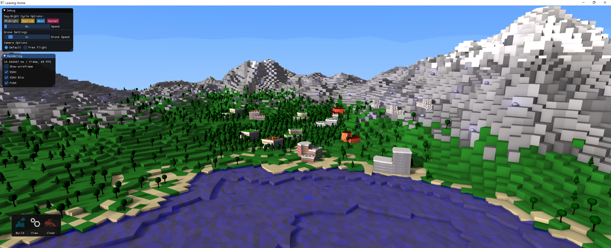
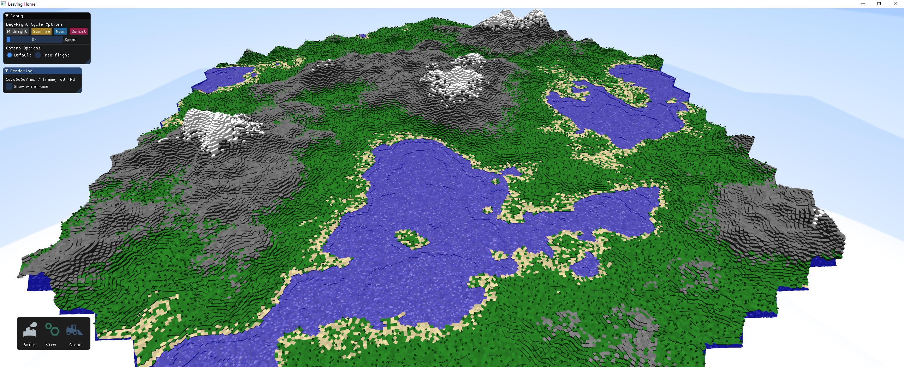
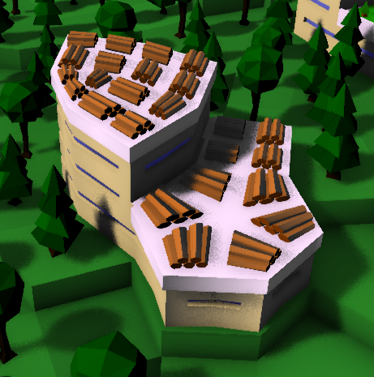
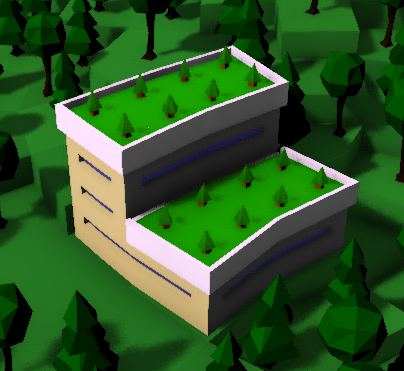
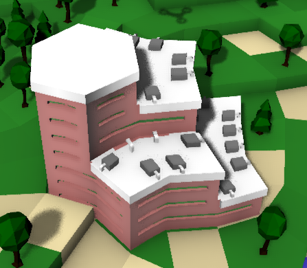
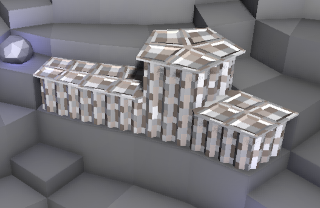
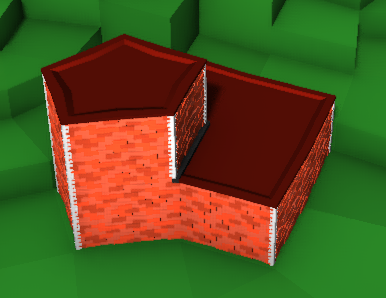
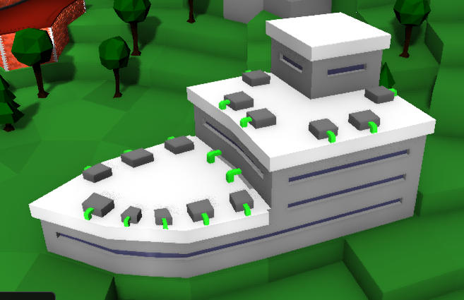
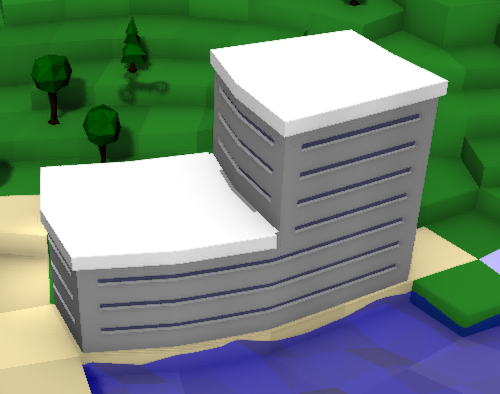

# Introduction

Leaving Home is a very rudimentary economic simulation game created for a computer graphics course. It is inspired by economic simulation games such as the [Anno](https://en.wikipedia.org/wiki/Anno_%28series%29) and the [The Settlers](https://en.wikipedia.org/wiki/The_Settlers) series as well as by the irregular grid and the procedural buildings used in the game [Townscaper](https://en.wikipedia.org/wiki/Townscaper).

---

# Features

As the main purpose of the course was to implement some of the rendering techniques and optimization structures presented in the lectures about computer graphics, the main focus of this project was our custom engine with the actual gameplay and game content being more of a secondary thing.

## Engine Features

Besides the most basic features of any game engine (i.e. loading and rendering meshes, handling shaders, Phong lighting, etc.) our engine implements the following features:
  - Instanced rendering
  - Deferred rendering
  - Frustum Culling
  - Skybox with a day/night cycle
  - Shadow mapping with PCF and randomized sampling
  - Screen space ambient occlusion (SSAO)
  - Anti-Aliasing using FXAA
  - Image-based picking

The interaction between the game and the engine is mostly handled using an entity component system (using [EnTT](https://github.com/skypjack/entt)). GUIs are supported using [ImGUI](https://github.com/ocornut/imgui).

## Game Features

The actual game is based on an irregular relaxed quadrilateral grid (i.e. the type of irregular grid used in the game [Townscaper](https://en.wikipedia.org/wiki/Townscaper), where grid cells can either be a triangle, a square, a pentagon or a hexagon) which in conjunction with a height map (using [FastNoise](https://github.com/Auburn/FastNoise)) forms the landscape of the game world. To add some more optical variation to the world, we also added low-poly water and harvestable resources (in the form of trees and rocks). An example of how the generated landscape may look like can be seen in the following image:

The user can place different types of buildings on the grid's cells and the game will procedurally generate building meshes using a modified variant of the Marching Cubes algorithm. Each type of building serves a different purpose and can produce, consume or store certain items:

| Building type | Example image | Description |
| --- | --- | --- |
| Woodcutter |  | Cuts trees in its surrounding area to produce wood and biomass. |
| Reforester |  | Consumes biomass to plant trees in its surrounding area. |
| Food Factory |  | Consumes biomass to produce food. |
| Mine |  | Produces stone and ore mined from deep underground. Can only be placed on stone cells. |
| Storage |  | Can store items of any type. |
| Drone Hub |  | Can be told to construct drones. Consumes ore for each drone to construct. |
| Residence |  | A building offering space for citizens to live in. Consumes food.   Ideally, the inhabitants of this building type should be simulated to allow for some form of punishment if the building runs out of food causing the inhabitants to starve, but we didn't find enough time to implement this. |

Finally, moving agents in the form of flying drones are responsible for constructing buildings as requested by the user and for moving resources between buildings.

## Unintended Features

Due to the fact that the game and the engine were created in a very constrained time frame of roughly three months, the game and the engine also contain some unintended features (also known as bad software architecture, bugs and code smells). Some of the known unintended features are:

  - Bad software architecture: Due to the fact that we weren't familiar with the ECS (Entity Component System) architectural pattern before we started this project, most parts of the data structure for storing the world (i.e. chunks, cells and their contents) were modelled using a traditional object oriented approach using inheritance where it would be in fact a better solution to model everything using components and systems (i.e. the C and the S in ECS). This caused parts of the code to consist of both an object oriented inheritance structure and the ECS, which resulted in these parts of the codebase having a very bad software architecture.
  - Horrible code smells: Due to the short time frame of roughly three months from start to finish, we didn't find the time to perform some necessary refactorings to reduce some of the unnecessary complexity which resulted from adding more and more features to the engine and the game. Some parts of the code are in a really bad state...
  - The world generator isn't completely deterministic: The generated world should only change when the seed changes. While this applies to the grid's topology (i.e. the adjacencies between cells), it does *not* apply to the ID assigned to each cell due to a bug overseen when the world generator was implemented. This bug can cause cells to have a different type (i.e. grass, sand, stone or snow) when the world is generated multiple times with the same seed. As we didn't have that much time left before the project had to be finished, we didn't find the time to fix this bug.
  - The game state can't be persisted to disk: Due to the world generator not being completely deterministic, the cells are assigned different IDs which is obviously bad when saving the game state and loading it later on. If we had more time, we could have fixed the bug in the world generator and could therefore also have implemented some form of persistence.
  - The seed of the world generator is set to a fixed value (however this could be changed easily).
  - Buildings have no limit how much items they can store in their inventory.
  - There is no limit to the height of buildings which might cause drones to fly through buildings.
  - The game might randomly crash after being executed for longer than ~40 minutes: This bug seems to be related to the inventories of reforesters, but we didn't find the time for further investigations.
  - The game might crash on exit instead of stopping normally.

---

# Build instructions

Start by cloning this repository into some directory on your machine.

After cloning the repository, the ./lib directory inside the directory into which the repository was cloned will need to be populated with the following libraries:
  - [EnTT version 3.5.2](https://github.com/skypjack/entt/releases/tag/v3.5.2) (download, extract and store the source code inside ./lib/entt)
  - [FastNoise version 1.0.1](https://github.com/Auburn/FastNoise/releases/tag/v1.0.1) (download, extract and store the source code inside ./lib/fastnoise)
  - [GLEW version 2.1.0](https://github.com/nigels-com/glew/releases/tag/glew-2.1.0) (download, extract and store the source code inside ./lib/glew)
  - [GLFW version 3.3.2](https://github.com/glfw/glfw/releases/tag/3.3.2) (download, extract and store the source code inside ./lib/glfw)
  - [GLM version 0.9.9.8](https://github.com/g-truc/glm/releases) (download, extract and store the source code inside ./lib/glm)
  - [ImGUI version 1.79](https://github.com/ocornut/imgui/releases/tag/v1.79) (download, extract and store the source code inside ./lib/imgui)
  - [readerwriterqueue version 1.0.3](https://github.com/cameron314/readerwriterqueue/releases/tag/v1.0.3) (download [atomicops.h](https://github.com/cameron314/readerwriterqueue/blob/435e36540e306cac40fcfeab8cc0a22d48464509/atomicops.h) and store as ./lib/readerwriterqueue/atomicops.h and download [readerwriterqueue.h](https://github.com/cameron314/readerwriterqueue/blob/435e36540e306cac40fcfeab8cc0a22d48464509/readerwriterqueue.h) and store as ./lib/readerwriterqueue/readerwriterqueue.h)
  - [stb version 2.26](https://github.com/nothings/stb/blob/b42009b3b9d4ca35bc703f5310eedc74f584be58/stb_image.h) (download and store as ./lib/stb/stb_image.h)
  - [tinyobjloader version 1.0.6](https://github.com/tinyobjloader/tinyobjloader/releases/tag/v1.0.6) (download, extract and store the source code inside ./lib/tinyobjloader)

You *should* now be able to build the project using CMake. So far, we have only tested this using CMake and Visual Studio 2019's compiler on Windows, so we can't guarantee that it will also successfully compile on other platforms or with other compilers.

---

# Trivia

The name "Leaving Home" was chosen because we wanted to break up with the tradition of economic simulation games to be based on either a regular grid (i.e. mostly either a square grid or a hexagon grid) or no grid at all with buildings almost always having a fixed size and shape.
